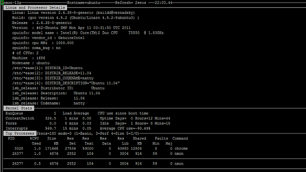

服务器监控工具 nmon
========================
13 April 2013 - Beijing

nmon，由Nigel Griffiths开发，能够监控Linux系统的性能，如处理器使用率、内存使用率、磁盘IO统计、网络I/O统计、内存页处理和进程信息等。

	$ man nmon
	nmon - systems administrator, tuner, benchmark tool.

	r   = Machine type, machine name, cache details and OS version + LPAR
	c   = CPU by processor stats with bar graphs
	l   = long term CPU (over 75 snapshots) with bar graphs
	m   = Memory stats
	L   = Huge memory page stats
	V   = Virtual Memory and Swap stats
	k   = Kernel Internal stats
	n   = Network stats and errors
	N   = NFS Network File System
	d   = Disk I/O Graphs
	D   = Disk I/O Stats
	o   = Disk I/O Map (one character per disk showing how busy it is)
	o   = User Defined Disk Groups
	j   = File Systems 
	t   = Top Process stats use 1,3,4,5 to select the data & order
	u   = Top Process full command details
	v   = Verbose mode - tries to make recommendations
	b   = black and white mode (or use -b option)
	.   = minimum mode i.e. only busy disks and processes
	

ubuntu下安装：
	sudo apt-get install nmon
	
